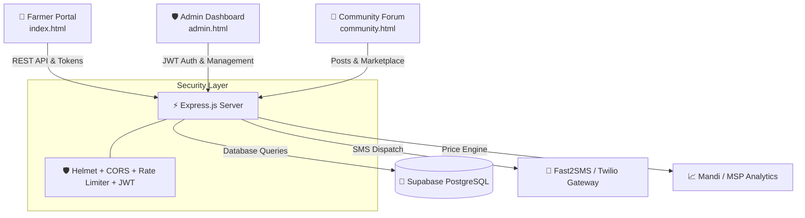

# 🌾 KISAN-MITRA (किसान मित्र)
### *Empowering Farmers with Smart Procurement, Transparent Mandi Access & Community Commerce*

[](https://nodejs.org/)
[](https://expressjs.com/)
[](https://supabase.com/)
[](LICENSE)
[](https://github.com/Charansaiesh/KISAN-MITRA)

---

## 📌 Overview

**KisanMitra** is a comprehensive agricultural technology platform built to revolutionize the grain procurement and mandi management experience for Indian farmers. By replacing chaotic physical mandi queues with transparent digital tokens, automated SMS updates, real-time market price discovery, and a peer-to-peer community marketplace, KisanMitra bridges the gap between agricultural producers and institutional markets.

---

## ✨ Key Features

### 🚜 1. Smart Token & Procurement System (`index.html`)
- **Digital Token Generation:** Instant generation of unique tokens (`KM-XXXXX`) for crop procurement slots.
- **Live Lifecycle Tracking:** 5-stage progress tracking (Registration Received → Verification → Slot Scheduled → Mandi Arrival & Weighment → Payment Disbursed).
- **Downloadable Gate Passes & Receipts:** Generate and print official mandi entry slips and weighment receipts.

### 📊 2. Live Mandi & MSP Price Discovery
- **Real-Time Agmarknet / APMC Rates:** Instant lookup of Min, Max, and Modal prices across district mandis.
- **Government MSP Comparison:** Real-time benchmark comparison showing whether market rates meet or exceed Minimum Support Prices (MSP).

### 📱 3. SMS Gateway & Multi-Channel Alerts
- **Integrated SMS Gateways:** Native support for **Fast2SMS** (India) and **Twilio** (Global) SMS APIs.
- **Feature Phone Accessibility:** Farmers receive instant SMS alerts with token status and mandi scheduling without requiring continuous internet connectivity.

### 🛡️ 4. Officer & Admin Management Dashboard (`admin.html`)
- **Queue & Slot Management:** Officers can inspect pending registrations, assign inspection dates, and update progress percentages.
- **Weighment & Payment Verification:** Record verified crop weights and trigger instant payment status updates.
- **Role-Based Access Control:** Secure JWT authentication with farmer, officer, and admin role permissions.

### 👥 5. Community Marketplace & Farmer Forum (`community.html`)
- **Direct P2P Trading:** Buy and sell crops, seeds, fertilizers, and equipment directly without middlemen commissions.
- **Logistics & Transport Sharing:** Coordinate shared transport vehicles to reduce crop transport overhead costs.
- **Interactive Farmer Q&A:** Ask questions, share farming best practices, and receive peer advice.

### 🌐 6. Regional Language Support
- Fully localized UI support for English, Hindi (हिन्दी), Telugu (తెలుగు), and more regional dialects.

---

## 🏗️ System Architecture



---

## 🗄️ Database Schema

The database is built on **PostgreSQL (Supabase)** with relational integrity and automatic timestamps:

| Table | Purpose |
|---|---|
| `users` | Secure authentication with roles (`farmer`, `officer`, `admin`) and hashed credentials |
| `crop_reports` | Smart procurement tokens, farmer details, crop specifications, and status |
| `token_steps` | 5-stage procurement step verification and timestamp logs |
| `mandi_prices` | Agmarknet district mandi rates, modal prices, and MSP reference rates |
| `community_posts` | Buy/sell marketplace listings and equipment rental classifieds |
| `community_comments`| Threaded discussion replies and farmer advisory interactions |
| `notifications` | Audit log of dispatched SMS and in-app notifications |
| `feedback` | Platform ratings and feedback from farmers and officers |

---

## 🚀 Getting Started

### Prerequisites
- [Node.js](https://nodejs.org/) (v16.x or higher)
- [npm](https://www.npmjs.com/) or [yarn](https://yarnpkg.com/)
- (Optional) [Supabase](https://supabase.com/) account for cloud PostgreSQL storage

### Installation

1. **Clone the Repository:**
   ```bash
   git clone https://github.com/Charansaiesh/KISAN-MITRA.git
   cd KISAN-MITRA
   ```

2. **Install Dependencies:**
   ```bash
   npm install
   ```

3. **Configure Environment Variables:**
   Copy `.env.example` to `.env`:
   ```bash
   cp .env.example .env
   ```
   Edit `.env` and fill in your configuration:
   ```env
   PORT=5000
   NODE_ENV=development
   
   # Supabase Configuration (Leave empty to use built-in memory fallback)
   SUPABASE_URL=https://your-project.supabase.co
   SUPABASE_SERVICE_ROLE_KEY=your-supabase-service-role-key
   SUPABASE_ANON_KEY=your-supabase-anon-key
   
   # JWT Configuration
   JWT_SECRET=your_super_secret_jwt_key
   JWT_EXPIRES_IN=7d
   ADMIN_INITIAL_SECRET=admin123
   
   # SMS Gateway (Fast2SMS or Twilio)
   FAST2SMS_API_KEY=your_fast2sms_api_key
   ```

4. **Initialize Database (Optional for Supabase):**
   Execute the queries in `schema.sql` inside your Supabase SQL Editor.

5. **Start the Application:**
   ```bash
   # Development mode with auto-reload
   npm run dev
   
   # Production mode
   npm start
   ```

6. **Access Portals:**
   - 🌾 **Farmer Portal:** [http://localhost:5000/index.html](http://localhost:5000/index.html)
   - 🛡️ **Admin Portal:** [http://localhost:5000/admin.html](http://localhost:5000/admin.html)
   - 👥 **Community Portal:** [http://localhost:5000/community.html](http://localhost:5000/community.html)
   - 🩺 **Health Check:** [http://localhost:5000/api/health](http://localhost:5000/api/health)

---

## 📡 API Reference Endpoints

| Method | Endpoint | Description | Access |
|---|---|---|---|
| `GET` | `/api/health` | Service health status and database connection info | Public |
| `POST` | `/api/auth/register` | Register a new farmer or officer account | Public |
| `POST` | `/api/auth/login` | Authenticate user & receive JWT token | Public |
| `POST` | `/api/tokens/register` | Create a new crop procurement token | Public / Farmer |
| `GET` | `/api/tokens/track/:token` | Track token status and lifecycle progression | Public / Farmer |
| `GET` | `/api/mandis/prices` | Retrieve live mandi market prices & MSP data | Public |
| `GET` | `/api/admin/tokens` | List all registered tokens for administration | Admin / Officer |
| `PATCH`| `/api/admin/tokens/:token`| Update token workflow status & progress | Admin / Officer |
| `GET` | `/api/community/posts` | Fetch marketplace listings and forum posts | Public |
| `POST`| `/api/community/posts` | Create a new buy/sell listing | Authenticated |

---

## 🔒 Security Best Practices

- **Zero Secret Exposure:** `.env` and sensitive credentials are encrypted and ignored by `.gitignore`.
- **Helmet.js Headers:** Protects against well-known web vulnerabilities.
- **DDoS & Brute Force Protection:** Express Rate Limiting restricts excessive automated requests.
- **Sanitized SQL Queries:** Parameterized SQL queries prevent SQL injection risks.

---

## 🤝 Contributing

Contributions, issues, and feature requests are welcome!
1. Fork the Project
2. Create your Feature Branch (`git checkout -b feature/AmazingFeature`)
3. Commit your Changes (`git commit -m 'Add some AmazingFeature'`)
4. Push to the Branch (`git push origin feature/AmazingFeature`)
5. Open a Pull Request

---

## 📄 License

Distributed under the MIT License. See `LICENSE` for more information.

---

<p align="center">Made with ❤️ for Indian Farmers and the Agriculture Ecosystem 🌾</p>
